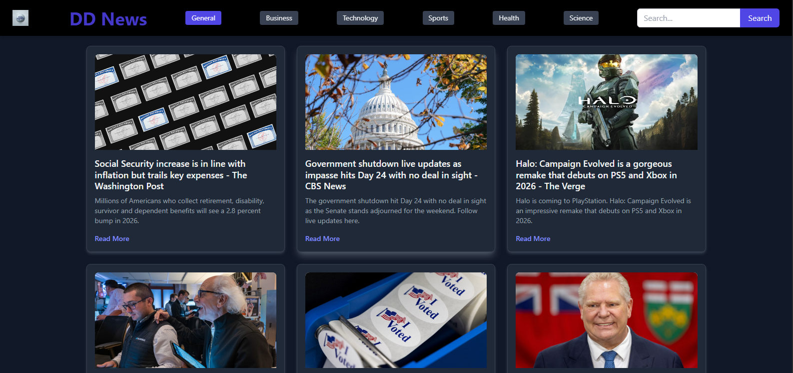

# Daily Dispatch - React News Feed App

A clean and modern news feed application built with React and styled with Tailwind CSS, created as part of the AppDost Web Developer Internship assignment. The app fetches live news articles from the **GNews API** and allows users to search for news by keyword and filter by category.



## Features

- **Live News:** Displays top headlines from the US or search results from GNews API.
- **Search Functionality:** Allows users to search for news articles by keyword.
- **Category Filtering:** Allows filtering news by specific topics (e.g., Business, Technology, Sports).
- **Article Display:** Shows article title, image (with fallback for missing images), description, and a link to the full article.
- **Loading & Error States:** Provides clear user feedback during data fetching and if API errors occur.
- **Responsive Design:** Optimized for various screen sizes using Tailwind CSS.
- **Modern UI:** Clean, intuitive, and visually appealing interface.

## Tech Stack

- **Frontend:** React.js (Vite, Functional Components, Hooks - `useState`, `useEffect`)
- **Styling:** Tailwind CSS (using Play CDN)
  - _Note: The Play CDN was used for rapid prototyping and local development convenience. For production environments, installing Tailwind CSS as a PostCSS plugin is recommended as per Tailwind's documentation._
- **API:** [GNews API](https://gnews.io/)
- **Proxy:** Vite development server proxy for API requests

## Getting Started Locally

1.  **Clone the repository:**
    ```bash
    git clone [https://github.com/srivishnu1644/DD-News](https://github.com/srivishnu1644/DD-News)
    cd DD-News
    ```
2.  **Install dependencies:**
    ```bash
    npm install
    ```
3.  **Get API Key:**
    - Sign up for a free API key at [GNews.io](https://gnews.io/).
    - Create a file named `.env` in the **root directory** of the project.
    - Add your API key to this file:
      ```
      VITE_NEWS_API_KEY=YOUR_GNEWS_API_KEY_HERE
      ```
    - _(Ensure `.env` is added to your `.gitignore` file for security, which it should be if you followed previous steps.)_
4.  **Run the development server:**
    ```bash
    npm run dev
    ```
    The app should now be running on `http://localhost:5173` (or another port).

## Deployment

This application is deployed on Netlify. To run it live, you must also set the `VITE_NEWS_API_KEY` environment variable in your Netlify (or other hosting) dashboard under "Site settings" > "Build & deploy" > "Environment variables".

## Live Demo

View the deployed application here: **https://dd-news.netlify.app/**

## GitHub Repository

Find the source code here: **https://github.com/srivishnu1644/DD-News**

---

_This project was created by Sri Vishnu for the AppDost Web Developer Internship assignment._
